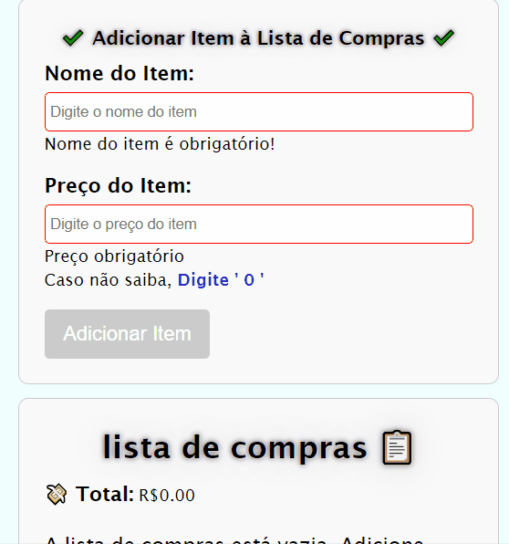

# Lista de Compras Angular
==========================

### Tecnologias Utilizadas
- Angular
- TypeScript
- HTML
- SCSS
- Web Storage
- Local Storage

### Funcionalidades
- Listagem de produtos
- Adicionar produtos
- Remover produtos
- Editar produtos
- Ordenação dos produtos Comprados e dos produtos na lista de Compras
- Valor total dos itens comprados
- Valor total dos itens na lista de compras
- Exclusão de produtos Comprados, movendo os mesmos para a lista de compras.

### Guia de Uso
- Após entrar no site, comece adicionando o produto na lista de itens:
   - Após o envio do Produto, o site salva e renderiza o produto adicionado.
- Com produto(s) adicionado(s), você pode excluir ou editar qualquer produto cadastrado.
- Para Marcar os itens ta lista como adquiridos é preciso clicar no botão `add 🛒`

###### Implementação de Icones de Código Unicode decimal, exemplo: `&#128512;` para 😀.

### Preview 

